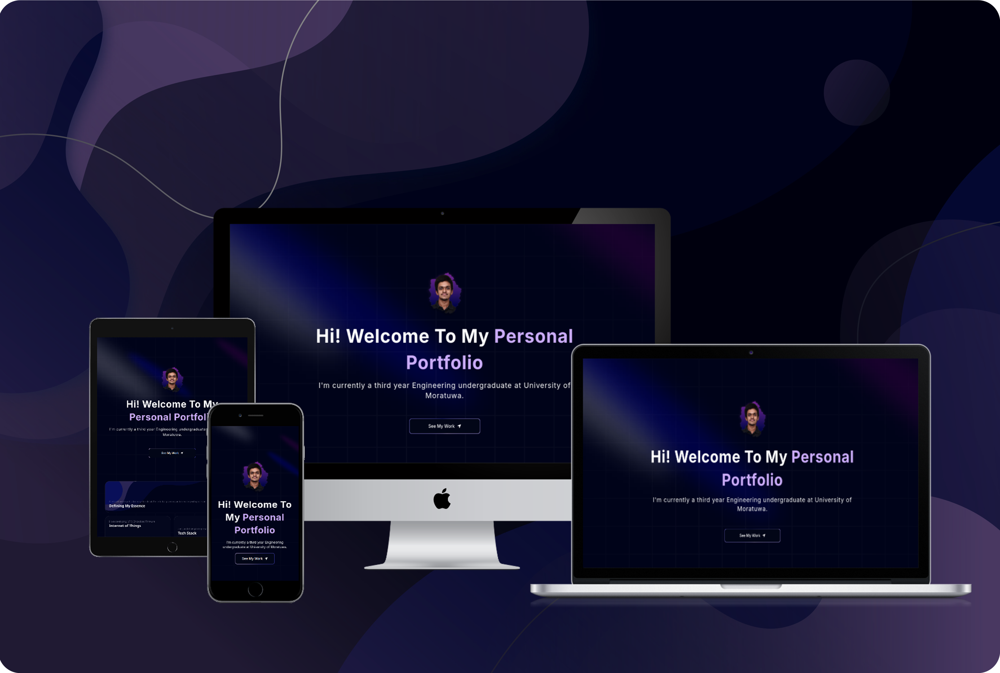
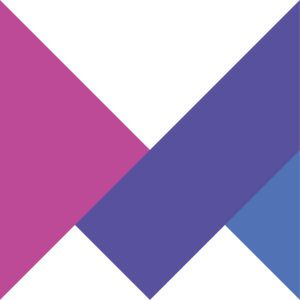

# Get Started

## Pre Requisites
* Node setup with NPM (or other suitable package manager)

## Setup

1. Clone the Repository.
```bash
    git clone https://github.com/chathura-de-silva/Portfolio
```

2. cd into the project and open a terminal.
>[!IMPORTANT]<br>
>  NextJS does not allow Capital letters when naming the project root directory. You may have to rename the repository root directory to 'portfolio', Do this only if you encounter any such issues.


3. Run following to install dependencies.
```bash
npm install
```

4. Run the Project. (You may have to configure the environment accordingly inside `next.config.mjs`.)

*   For development purposes,

    ```bash
    npm run dev
    ```
*   For Production, Build first and then run using,

    1.  ```bash
        npm run build
        ```

    2.  ```bash
        npm start
        ```


*   Exporting a static output.
    
    *   Since the project builds a static site, you could export a static build by updating the `next.config.mjs` by adding `output:'export'` inside nextconfig object.

        ```mjs
        /** @type {import('next').NextConfig} */
        const nextConfig = {output:'export'};

        export default nextConfig;
        ```
    *   Now start the production server using,
        ```bash
        npm start
        ```
        
# Tech Stack 

<table style="width: 100%; border-collapse: collapse;">
  <tr>
    <td style="width: 16.66%; padding: 10px; text-align: center;">
      
    </td>
    <td style="width: 16.66%; padding: 10px; text-align: center;">
      
    </td>
    <td style="width: 16.66%; padding: 10px; text-align: center;">
      
    </td>
    <td style="width: 16.66%; padding: 10px; text-align: center;">
      
    </td>
    <td style="width: 16.66%; padding: 10px; text-align: center;">
      
    </td>
    <td style="width: 16.66%; padding: 10px; text-align: center;">
      
    </td>
  </tr>
</table>

# Additional Notes

*   When it comes to deploying in the github pages, it assigns you a subdomain but the root is always the domain. So the absolute URLs defined in the project for the assets get broke and will display alts. There is a workaround for this by changing the basepath in the above mentioned `next.config.mjs`, but did not work well for me. It caused some other URLs to broke. This was not an issue when I deploy the production build to the Azure cloud static server with github actions and most of the time this won't be an issue other than in github pages.

*   I made each and every component dynamic so they get dynamically rendered in the project. Almost all the abstract text information is located inside `./data/index.ts`.

*   Favicon does not work on development builds for some reason. But it does on production builds.

* Testimonial section with a section(Client Section) to include companies worked has been implemented but commented out. When ever needed can get back by enabling them inside `page.tsx` 

* In Project section, passing "Closed Source" as the resource URL inside `./data/index.ts` will hide the `Check out on Github` button disabling the anchor tag.

# Useful Resources

*   [SVG Repo](https://www.svgrepo.com/)
*   [Next App Deployment](https://nextjs.org/docs/pages/building-your-application/deploying)
*   [Vectors](https://www.toools.design/free-open-source-icon-libraries)
*   [How to Deploy Next.js Apps to Github Pages](https://www.freecodecamp.org/news/how-to-deploy-next-js-app-to-github-pages/)